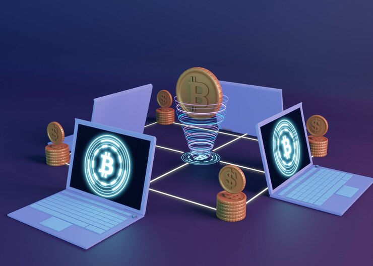

# Metaverse Domains: The Next Bitcoin in the Digital Frontier?

 

## "Metaverse Domains: The Next Bitcoin in the Digital Frontier?"

In the dynamic landscape of digital assets, the emergence of meta domains has sparked debates on whether they are merely a passing trend or the next big thing, similar to Bitcoins. Let’s delve into the factors that shape the narrative around meta-domains and explore their potential as the next frontier in the digital economy.

## Comparison between Meta Domains and Bitcoins

1. Blockchain Technology:
Meta Domains: Utilize blockchain for secure and verifiable ownership within the Metaverse.
Bitcoins: Operate on the blockchain as a decentralized digital currency.

2. Potential for Value Appreciation:
Meta Domains: Have potential for value appreciation due to scarcity, uniqueness, and demand.
Bitcoins: Gained substantial value over time, becoming valuable investments.

3. Digital Economy Impact:
Meta Domains: Influence the digital landscape by providing exclusive ownership and opportunities within the Metaverse.
Bitcoins: Shaped the digital economy by challenging traditional financial structures.

4. Strategic Investments:
Meta Domains: Involve strategic acquisition and potential resale, similar to domain flipping.
Bitcoins: Investments are often strategic, with people holding and trading based on market trends.

5. Changing Paradigms:
Meta Domains: Challenge traditional concepts of online presence and ownership.
Bitcoins: Recognized for challenging established financial norms.

## Are Meta Domains Similar to Bitcoins in Terms of Investment Potential?

While both Meta Domains and Bitcoins fall under the category of digital assets, they serve different purposes:
Meta Domains: Specific to the Metaverse, acting as unique addresses for virtual spaces.
Bitcoins: A form of cryptocurrency, often viewed as a store of value or speculative investment.

## Shared Features of Meta Domains and Bitcoin

1. Digital Assets:
Both are digital assets with investment potential.

2. Blockchain Technology:
Utilize blockchain for security, transparency, and decentralized operations.

3. Limited Supply:
Bitcoin: Capped supply of 21 million coins.
Meta Domains: Limited and unique, contributing to scarcity.

4. Investment Potential:
Both present investment opportunities within their respective realms.

5. Decentralization:
Operate in decentralized environments, promoting security and user control.

## Key Differences Between Meta Domains and Bitcoin

1. Purpose:
Bitcoin: A digital currency for peer-to-peer transactions and a store of value.
Meta Domains: Unique virtual addresses within the Metaverse.

2. Utility:
Bitcoin: Primarily a form of currency.
Meta Domains: Provide exclusive ownership and access to virtual spaces.

3. Ecosystem:
Bitcoin: Part of the broader cryptocurrency ecosystem.
Meta Domains: Specific to the Metaverse and its evolving ecosystem.

## Where to Buy and Sell Meta Domains

For those interested in exploring the investment potential of Meta Domains, platforms like **[NameZage](https://namezage.com/affliate/1kagpsd8ulgggcs)**, Ogett, and Cipzi offer a range of options tailored to the needs of virtual environments and decentralized platforms. These registrars provide marketplaces where users can buy and sell Meta Domains, making it easier to secure a memorable and relevant online presence in the Metaverse.

## Why Meta Domains Might Be a Big Opportunity

1. Digital Real Estate Value:
Hold significant value similar to physical real estate, offering opportunities for development, monetization, and trade.

2. Rising Popularity of the Metaverse:
Increasing demand for unique Metaverse domains as more users explore virtual environments.

3. Diverse Applications:
Serve as spaces for social interactions, business transactions, gaming, education, and more.

4. Technological Advancements:
Growth in VR, AR, and immersive technologies contributes to the value of Meta Domains.

5. Economic Opportunities:
Enable businesses to establish a digital presence, conduct transactions, and offer products and services in the Metaverse.

## Challenges and Drawbacks of Meta Domains

1. VR Device Adoption:
The limited popularity of VR devices may hinder the widespread acceptance of metadomains.

2. Global Popularity Constraints:
Cultural, economic, and technological differences could affect global acceptance.

3. Early Development Stage:
Unforeseen challenges may emerge as the Metaverse and metadomains continue to evolve.

## FAQs

Q: How do Meta Domains differ from traditional domains regarding investment? 
A: Meta Domains are part of the Metaverse and leverage blockchain technology for secure ownership with no renewal fees, unlike traditional domains that require periodic renewals.

Q: What makes Meta Domains a good investment? 
A: Factors include exclusive ownership, unique features tailored to the Metaverse, potential for value appreciation, low current prices, and the ability to navigate the evolving digital landscape.

Q: Can anyone invest in Meta Domains? 
A: Thanks to blockchain’s minting system, anyone can invest in metadomains and transfer ownership globally.

Q: How do Metadomains contribute to the development of the Metaverse? 
A: They serve as unique addresses for virtual spaces, enhancing navigation, access, and control over digital presence within the Metaverse.

Q: What potential challenges or risks are associated with investing in metadomains? 
A: Challenges include slow VR device adoption, varying popularity by region, and the Metaverse's early development stage.

## Conclusion

The exploration into whether Meta Domains could be the next Bitcoins reveals a landscape rich with potential and transformative possibilities. While both share commonalities in leveraging blockchain technology and presenting investment opportunities, they serve distinct purposes and operate in different spheres.
With their exclusive ownership within the Metaverse, Meta Domains stand poised to play a significant role in shaping the digital future. As we navigate this dynamic digital frontier, the strategic acquisition of Meta Domains and the practice of domain flipping within the Metaverse evoke parallels with investment strategies in the cryptocurrency space.
The comparison prompts us to envision the potential trajectories of emerging digital assets and their impact on the broader digital landscape. Whether Meta Domains follow the path of Bitcoins remains an open question. Still, the exploration invites us to embrace the unfolding possibilities and innovations in the ever-expanding digital universe.
